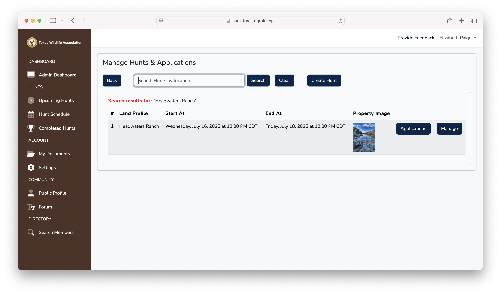
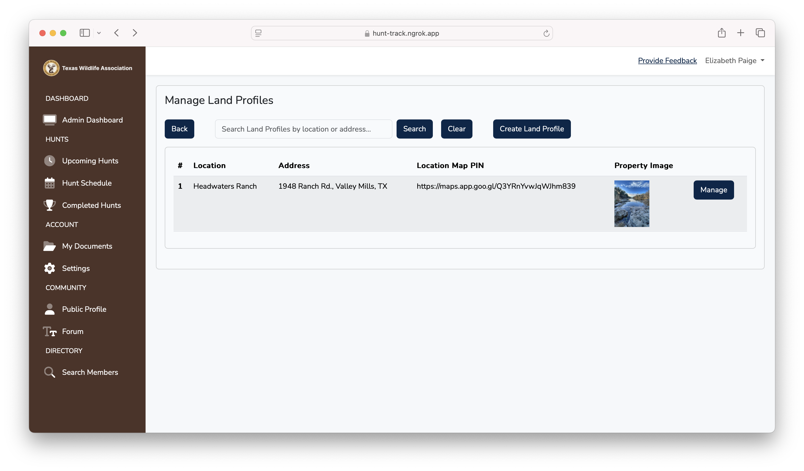
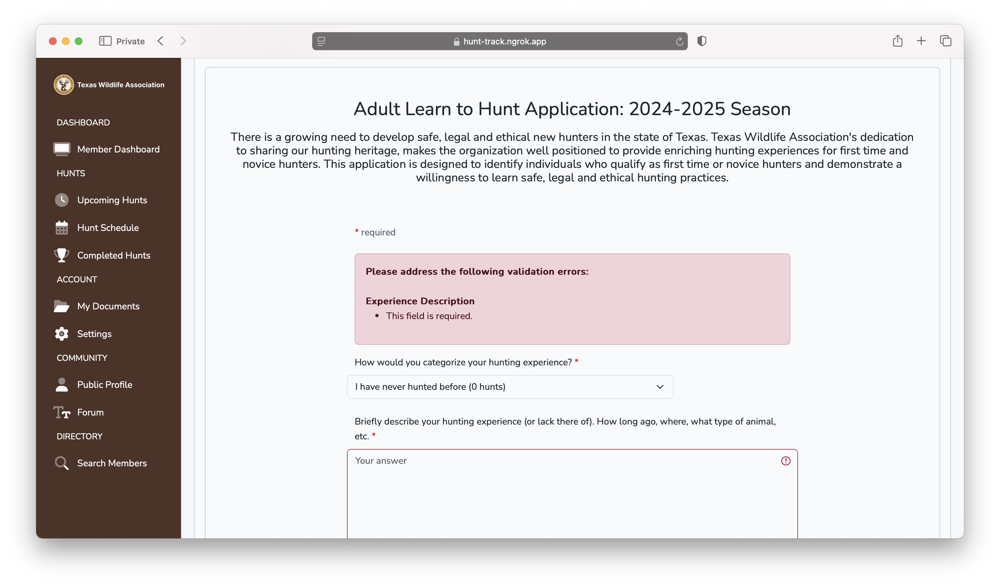
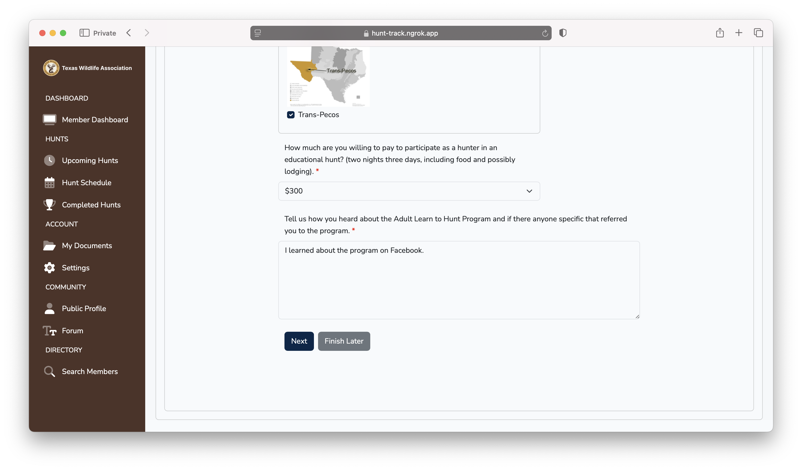
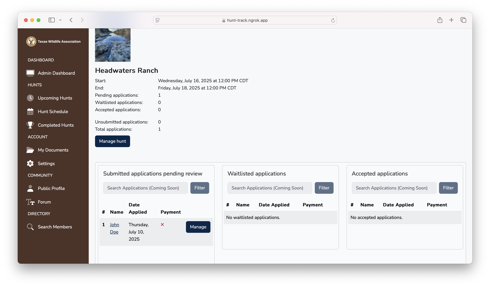
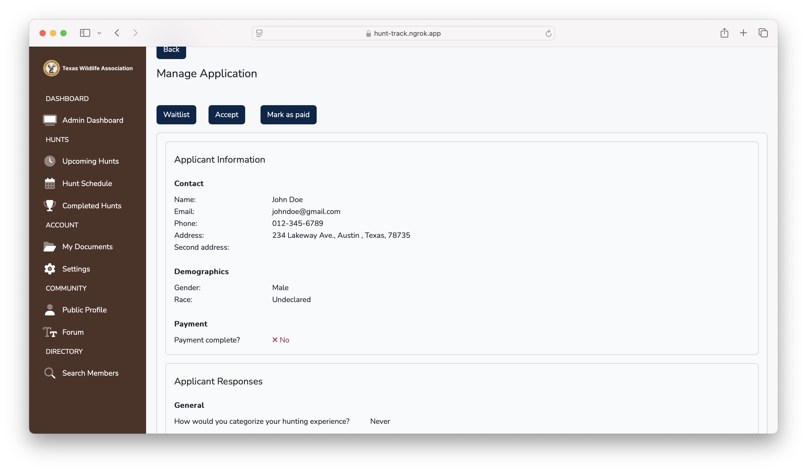
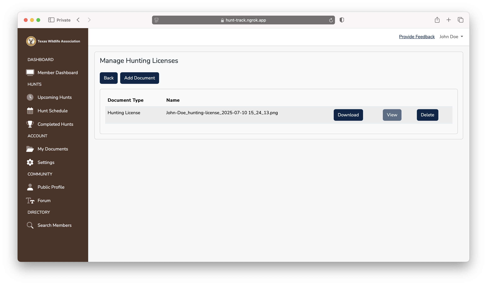
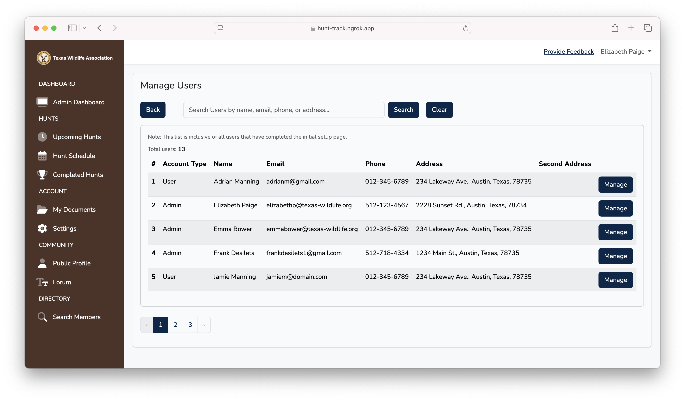

# wildlife-connects

Wildlife Connects is a full-stack web portal that was developed for <a href="https://www.texas-wildlife.org" target="_blank">Texas Wildlife Association</a> during a spring 2025 internship with FreeLikeYou, a company founded by a Southwestern University alumnus. I designed and implemented the platform in its entirety.

It is the intellectual property of FreeLikeYou and as such code cannot be shared. Rather, this document aims to showcase the impact and high-level details of the project.

*Note: All screenshots in this document were approved by FreeLikeYou to share. They were taken from a local development environment with fake accounts and information. Screenshots are located at the [bottom](#newsletter) of the document.*

## Description

The application automated and replaced Texas Wildlife Association's existing manual, email-based "Adult Learn to Hunt" application system, and streamlined workflows for over 800 members applying to hunts as well as for administrators reviewing and managing applications and supporting documents by providing an intuitive, centralized platform.

The portal is both internal and external. User accounts have member functionality (apply to hunts, upload documents, etc.) and admin accounts have administrative abilities (manage land profiles and hunts, manage hunt applications, manage users and documents, etc.) in addition to normal member functionality. The only difference between a user and admin account is the dashboard, as users have a member dashboard and admins have an administrative dashboard (as such, all administrative controls are located in the admin dashboard). The rest of the platform is identical for both users and admins.

## Technology

### Back-end: 

Laravel was used as the backend PHP framework due to its expansive feature set, which includes MVC architecture, routing, robust security including authentication, Eloquent ORM, database migrations, and validation.

### Front-end:

Bootstrap was used at the front-end HTML and CSS framework.

### Database:

MySQL was used as the database management system. It was interacted with primarily through Laravel’s Eloquent ORM.

### Cloud:

Laravel Cloud was used as the infrastructure and deployment platform due to its exclusive support and optimization for Laravel applications.

Google Cloud Platform was used for a Google Drive API integration, facilitating cloud storage of user documents.

## Features

### General Features

Note: Some sections in the left sidebar of the application will be developed in a later release. As such, they are not included below.

-	Hunt creation and application system
-	Land Profiles (representing specific properties that hunts can be hosted on)
-	Document management (Google Drive integration)
-	User management

### Administrative Features

*Admin Dashboard*
  - Manage Hunts
    - Table view of hunts, sorted in ascending order by start date
    - Search, create, delete, and view hunts
  - Manage Applications
    - Application statistics for specific hunt
    - Table views for pending, waitlisted, and accepted applications, sorted in ascending order by date submitted
    - Manage applications, including changing status and marking as paid
  - Manage Land Profiles
    - Table view of Land Profiles, sorted in ascending order by location
    - Search, create, delete, and view land profiles
  - Document Repository
    - Table view of documents for a specific user, sorted by document type
    - Manage documents, including downloading and deleting
  - Manage Users
    - Table view of users, sorted in ascending order by first name
    - Search for and view users

### Member Features

*Member Dashboard*   
*Upcoming Hunts*
  - View hunts the currently authenticated user has been accepted to
  - View application status and information, such as dates and payment details

*Hunt Schedule*
  - View the upcoming hunt schedule
  - View a specific hunt
  - Apply to a specific hunt
    
*My Documents*
  - Manage documents for the currently authenticated user, including uploading, downloading, and deleting

## Testing

The platform was, of course, tested during development, but the majority of testing came from stakeholders at Texas Wildlife Association as they used the system, refined their ideas, and found bugs.

## Newsletter

Below is the July 2025 newsletter that was sent by Texas Wildlife Association to all members announcing the new platform for the summer application season.

*Note: This is not the full newsletter, as sections not pertaining to Wildlife Connects were edited out.*

## Screenshots

Below are a few screenshots of major features of the platform. Standard pages such as login and registration have been omitted.  

Post-registration account setup

Manage land profiles (admin)

Manage hunts (admin)

Apply to a specific hunt

Apply to a specific hunt

Manage applications for specific hunt (admin)

Manage specific application (admin)

Manage specific document types

Manage users (admin)

